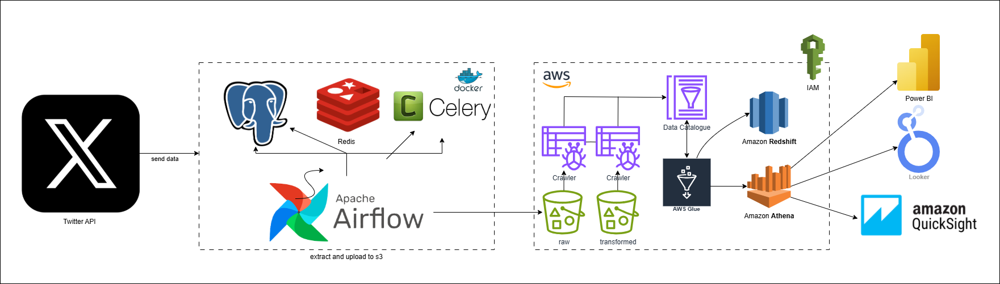

# 🧠 X (Twitter) ETL Pipeline — Sentiment & Emotion Analysis

## 🚀 Overview
This project is an **end-to-end ETL pipeline** that extracts, transforms, and analyzes tweets from **X (Twitter)** in real-time.  
It focuses on understanding **public sentiment and emotions** about a chosen **topic** — such as *AI*, *Palestine*, *Climate Change*, etc.

The pipeline automates:  
1. 🔍 **Extraction** of tweets via the X API  
2. 🧹 **Transformation** — cleaning, filtering, and enriching the data  
3. 💡 **Sentiment & Emotion Analysis** using NLP models  
4. 💾 **Loading** into structured datasets for analytics and dashboards  

## 🧩 Architecture

1. **X API**: Source of the data.
2. **Apache Airflow, Redis & Celery**: Orchestrates the ETL process and manages task distribution.
3. **PostgreSQL**: Temporary storage and metadata management.
4. **Amazon S3**: Raw data storage.
5. **AWS Glue**: Data cataloging and ETL jobs.
6. **Amazon Athena**: SQL-based data transformation.
7. **Amazon Redshift**: Data warehousing and analytics.

## System Setup
1. Clone the repository.
   ```bash
    git clone https://github.com/seghiranass/AWS-End-To-End-X-ETL-Pipline.git
   ```
2. Create a virtual environment.
   ```bash
    python3 -m venv venv
   ```
3. Activate the virtual environment.
   ```bash
    source venv/bin/activate
   ```
4. Install the dependencies.
   ```bash
    pip install -r requirements.txt
   ```
5. Rename the configuration file and the credentials to the file.
   ```bash
    mv config/config.conf.example config/config.conf
   ```
6. Starting the containers
   ```bash
    docker-compose up -d
   ```
7. Launch the Airflow web UI.
   ```bash
    open http://localhost:8080
